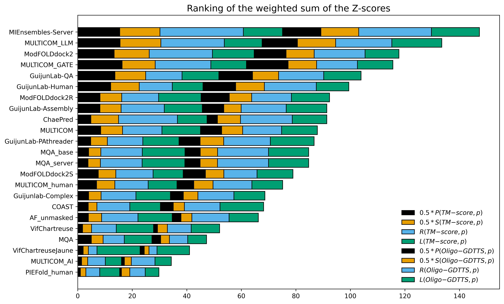

# GATE: Graph Transformers for Estimating Protein Model Accuracy

## Table of Contents
1. [Introduction](#introduction)
2. [Installation](#installation)
   - [Clone the Repository](#clone-the-repository)
   - [Install Mamba](#install-mamba)
   - [Install Tools](#install-tools)
   - [Set Up Python Environments](#set-up-python-environments)
   - [Download Databases](#download-databases)
3. [Configuration](#configuration)
4. [Usage](#usage)
   - [Required Arguments](#required-arguments)
   - [Optional Arguments](#optional-arguments)
   - [Example Commands](#example-commands)
5. [Citing This Work](#citing-this-work)
6. [Bonus](#bonus)

---

## Introduction

GATE is a tool designed for estimating protein model accuracy using advanced graph transformers. This repository contains the code, pre-trained models, and instructions for setup and usage.


### The overall performance of 23 CASP16 predictors in estimating the accuracy of the structural models of 36 out of 38 CASP16 multimer targets according to the z-scores of multiple evaluation metrics (i.e., Pearson's correlation, Spearman's correlation, AUC, and ranking loss) in terms of both TM-score and oligomer GDT-TS score. Each kind of z-score is denoted by a colored bar. The predictors are ordered according to the weighted sum of all the z-scores. 



### Table 1. Average per-target evaluation metrics (Pearson's correlation, Spearman's correlation, ranking loss and AUC) of 23 CASP16 predictors in terms of TM-score and Oligo-GDT-TS. The best performance for each metric is marked with [BEST], second-best with [2nd], and third-best with [3rd]. 

| Predictor Name       | Corrᵖ (TM-score) | Corrˢ (TM-score) | Ranking Loss (TM-score) | AUC (TM-score) | Corrᵖ (Oligo-GDT-TS) | Corrˢ (Oligo-GDT-TS) | Ranking Loss (Oligo-GDT-TS) | AUC (Oligo-GDT-TS) |
|----------------------|------------------|-------------------|-------------------------|----------------|---------------------|----------------------|----------------------------|--------------------|
| MULTICOM_LLM         | 0.6836 [2nd]    | 0.4808 [BEST]    | 0.1230          | 0.6685 [2nd]   | 0.6722 [3rd]      | 0.4656 [2nd]       | 0.1252 [BEST]             | 0.6603 [3rd]      |
| **MULTICOM_GATE**        | 0.7076 [BEST]   | 0.4514     | 0.1221 [3rd]          | 0.6680 [3rd]   | 0.7235 [2nd]      | 0.4399 [3rd]       | 0.1328 [2nd]             | 0.6461            |
| AssemblyConsensus    | 0.6367          | 0.4661 [2nd]     | 0.1824                | 0.6584         | 0.7701 [BEST]     | 0.5163 [BEST]      | 0.1753                   | 0.6702 [BEST]     |
| ModFOLDdock2         | 0.6542 [3rd]    | 0.4640 [3rd]     | 0.1371                | 0.6859 [BEST]  | 0.6547            | 0.4143             | 0.1530                   | 0.6588            |
| MULTICOM             | 0.6156          | 0.4380           | 0.1207 [2nd]         | 0.6660         | 0.6413            | 0.4319             | 0.1368 [3rd]            | 0.6536            |
| MIEnsembles-Server   | 0.6072          | 0.4498           | 0.1325                | 0.6670         | 0.6084            | 0.4091             | 0.1451                   | 0.6671 [2nd]      |
| GuijunLab-QA         | 0.6480          | 0.4149           | 0.1195 [BEST]         | 0.6328         | 0.6524            | 0.3972             | 0.1406                   | 0.6377            |
| GuijunLab-Human      | 0.6327          | 0.4148           | 0.1477                | 0.6368         | 0.6404            | 0.3976             | 0.1499                   | 0.6483            |
| MULTICOM_human       | 0.5897          | 0.4260           | 0.1518                | 0.6576         | 0.6149            | 0.4217             | 0.1498                   | 0.6572            |
| GuijunLab-PAthreader | 0.5309          | 0.3744           | 0.1331                | 0.6237         | 0.6360            | 0.4353      | 0.1371                   | 0.6382            |
| ModFOLDdock2R        | 0.5724          | 0.3867           | 0.1375                | 0.6518         | 0.6339            | 0.3724             | 0.1483                   | 0.6355            |
| GuijunLab-Assembly   | 0.5439          | 0.3280           | 0.1636                | 0.6191         | 0.5809            | 0.3135             | 0.1611                   | 0.6182            |
| ChaePred             | 0.4548          | 0.3971           | 0.1580                | 0.6534         | 0.4875            | 0.3673             | 0.1563                   | 0.6331            |
| ModFOLDdock2S        | 0.5285          | 0.3116           | 0.1806                | 0.6084         | 0.5819            | 0.3335             | 0.1648                   | 0.6129            |
| MQA_server           | 0.4326          | 0.2913           | 0.1468                | 0.6120         | 0.5617            | 0.3708             | 0.1521                   | 0.6323            |
| MQA_base             | 0.4331          | 0.2897           | 0.1462                | 0.6085         | 0.5533            | 0.3597             | 0.1509                   | 0.6281            |
| GuijunLab-Complex    | 0.4889          | 0.3019           | 0.1792                | 0.6054         | 0.5693            | 0.3310             | 0.1772                   | 0.6077            |
| AF_unmasked          | 0.4015          | 0.2731           | 0.1595                | 0.6052         | 0.4354            | 0.2875             | 0.1815                   | 0.6113            |
| MQA                  | 0.4410          | 0.2425           | 0.2183                | 0.5858         | 0.4911            | 0.2631             | 0.2499                   | 0.5874            |
| COAST                | 0.3840          | 0.2297           | 0.2091                | 0.6072         | 0.4484            | 0.2678             | 0.2204                   | 0.6078            |
| MULTICOM_AI          | 0.3281          | 0.2623           | 0.1913                | 0.6057         | 0.3843            | 0.2834             | 0.1963                   | 0.6111            |
| VifChartreuse        | 0.2921          | 0.2777           | 0.1440                | 0.6149         | 0.2982            | 0.2469             | 0.1641                   | 0.5956            |
| VifChartreuseJaune   | 0.3421          | 0.1756           | 0.1630                | 0.5951         | 0.3300            | 0.1548             | 0.1915                   | 0.5811            |
| PIEFold_human        | 0.1929          | 0.1451           | 0.2306                | 0.5497         | 0.2599            | 0.1759             | 0.2409                   | 0.5541            |


### Table 2: Comparison of evaluation metrics (Pearson's correlation, Spearman's correlation, ranking loss, and AUC) for different EMA methods applied to in-house structural models generated by MULTICOM4 in the CASP16 blind experiment. The evaluation was conducted using both TM-score and Oligo-GDT-TS. The best performance for each metric is shown in bold, and the second-best is underlined. The values marked with * are statistically significantly worse (p $<$ 0.05) than the GATE-Ensemble baseline based on the one-sided Wilcoxon signed-rank test.

| Method | Corrᵖ (TM-score) | Corrˢ (TM-score) | Ranking Loss (TM-score) | AUC (TM-score) | Corrᵖ (Oligo-GDT-TS) | Corrˢ (Oligo-GDT-TS) | Ranking Loss (Oligo-GDT-TS) | AUC (Oligo-GDT-TS) |
|---|---|---|---|---|---|---|---|---|
| PSS | _0.3947_ | 0.2523 | 0.1388 | 0.6384 | 0.3385 | 0.2495 | 0.1582 | 0.6282* |
| AlphaFold plDDT_norm | 0.3806 | _0.2731_ | 0.1334 | **0.6557** | _0.3663_ | _0.2557_ | **0.1206** | **0.6587** |
| DProQA_norm | -0.0507* | 0.0112* | 0.1942* | 0.5689* | 0.0319* | 0.0709* | 0.2225 | 0.5874 |
| VoroIF-GNN-score_norm | 0.0648* | 0.1157* | 0.1929* | 0.5995 | 0.1143* | 0.1704 | 0.2066 | 0.6222 |
| Avg-VoroIF-GNN-res-pCAD_norm | 0.0729* | 0.1046* | 0.1669 | 0.5887* | 0.0744* | 0.1374* | 0.2044 | 0.6155 |
| VoroMQA-dark global_norm | 0.0385* | 0.1443 | **0.1286** | 0.6094 | -0.0126* | 0.1456 | _0.1626_ | 0.6220 |
| GCPNet-EMA_norm | 0.3597 | 0.2491 | 0.1345 | 0.6431 | 0.3555 | 0.2642 | 0.1691 | 0.6476 |
| **GATE-Ensemble** | **0.4083** | **0.2774** | _0.1327_ | _0.6469_ | **0.3801** | **0.2989** | _0.1626_ | _0.6475_ |

### Table 3: Comparison of GATE model, GATE ablation variants, CASP15 EMA predictors and other methods in terms of Pearson's correlation, Spearman's correlation, ranking loss, and AUC based on TM-score and DockQ on the CASP15 complex structure dataset. The term norm indicates that the quality scores predicted by a method are normalized by the length of the predicted structure relative to the native structure. Only the performance of the normalization version of such a method is shown because their unnormalized outputs do not account for partial structures. Bold font denotes the best result, while the second best result is underlined. The values marked with * are statistically significantly worse (p $<$ 0.05) than the GATE-Ensemble baseline based on the one-sided Wilcoxon signed-rank test.

| Method | Corrᵖ (TM-score) | Corrˢ (TM-score) | Ranking Loss (TM-score) | AUC (TM-score) | Corrᵖ (DockQ) | Corrˢ (DockQ) | Ranking Loss (DockQ) | AUC (DockQ) |
|--------|------------|-----------|------------------|--------|--------------|--------------|--------------------|----------|
| **CASP15 EMA Predictors** |||||||||
| VoroMQA-select-2020 | 0.3944* | 0.3692* | 0.1735* | 0.6663* | 0.4322* | 0.4044 | 0.2682 | 0.6741 |
| ModFOLDdock | 0.5161* | 0.4356* | 0.1841 | 0.6721* | **0.5622** | **0.5185** | 0.2181 | **0.7022** |
| ModFOLDdockS | 0.4717* | 0.3614* | 0.2199* | 0.6333* | 0.4068* | 0.4073 | 0.3119* | 0.6632 |
| MULTICOM_qa | 0.6678* | 0.5260 | 0.1472 | 0.7059 | 0.5256 | 0.4668 | 0.2661 | 0.6748 |
| MULTICOM_egnn | 0.1437* | 0.1179* | 0.2611* | 0.5956* | 0.2158* | 0.2283* | 0.2943* | 0.6302 |
| VoroIF | 0.4645* | 0.3069* | 0.1568* | 0.6472* | 0.5039 | 0.3455* | 0.2297 | 0.6447 |
| ModFOLDdockR | 0.5333* | 0.4040* | 0.2160* | 0.6626* | 0.5357 | _0.4673_ | 0.2623 | 0.6787 |
| Bhattacharya | 0.3803* | 0.3438* | 0.2220* | 0.6495* | 0.3581* | 0.3190* | 0.3475* | 0.6392* |
| MUFold2 | 0.5370* | 0.2662* | 0.2374* | 0.6168* | 0.3846* | 0.1839* | 0.3850* | 0.5913* |
| MUFold | 0.5435* | 0.2714* | 0.2267* | 0.6252* | 0.3856* | 0.1356* | 0.3457* | 0.5865* |
| ChaePred | 0.4706* | 0.3507* | 0.2311* | 0.6592* | 0.4381* | 0.3545* | 0.3565* | 0.6615 |
| Venclovas | 0.4677* | 0.3828* | **0.1249** | 0.6756* | 0.5288 | 0.4506 | **0.1828** | _0.6890_ |
| **Other Methods (normalized if applicable)** |||||||||
| PSS | 0.7292 | 0.5755 | 0.1406 | 0.7137 | 0.5118 | 0.4469 | 0.2648 | 0.6660 |
| AlphaFold plDDT_norm | 0.2578* | 0.2611* | 0.1793 | 0.6399* | 0.1710* | 0.1886* | 0.2615* | 0.6165* |
| DProQA_norm | 0.1598* | 0.1174* | 0.2555* | 0.5942* | 0.2109* | 0.2255* | 0.3162* | 0.6248 |
| VoroIF-GNN-score_norm | 0.1972* | 0.0966* | 0.2092* | 0.5695* | 0.2283* | 0.1335* | 0.2935* | 0.5704* |
| Avg-VoroIF-GNN-res-pCAD_norm | 0.1335* | -0.0027* | 0.1737 | 0.5525* | 0.1049* | -0.0030* | 0.2284 | 0.5522* |
| VoroMQA-dark global_norm | 0.0253* | 0.0037* | 0.1265 | 0.5580* | -0.0670* | -0.0316* | 0.2191 | 0.5476* |
| GCPNet-EMA_norm | 0.3216* | 0.2696* | 0.2052* | 0.6379* | 0.1862* | 0.1803* | 0.2830* | 0.6198* |
| **GATE Models** |||||||||
| GATE-Basic | 0.7447 | 0.5722 | _0.1127_ | 0.7181 | 0.5330 | 0.4345 | 0.2348* | 0.6703 |
| GATE-GCP | 0.7453 | **0.5788** | 0.1186 | 0.7191 | _0.5358_ | 0.4389* | _0.2083_ | 0.6715 |
| GATE-Advanced | 0.7224* | 0.5416* | **0.1018** | 0.6981* | 0.5142 | 0.4298 | 0.2112 | 0.6618 |
| GATE-Ensemble | _0.7480_ | 0.5754 | 0.1191 | _0.7194_ | 0.5353 | 0.4477 | 0.2140 | 0.6756 |
| **GATE Ablation Variants** |||||||||
| GATE-Basic (w/o subgraph sampling) | 0.7169 | 0.5478* | 0.1266 | 0.7067 | 0.5063* | 0.4145* | 0.2620* | 0.6528* |
| GATE-GCP (w/o subgraph sampling) | **0.7503** | _0.5771_ | 0.1363 | **0.7278** | 0.5253 | 0.4394 | 0.2545* | 0.6773 |
| GATE-Advanced (w/o subgraph sampling) | 0.7158* | 0.5403* | 0.1224 | 0.7043* | 0.4975* | 0.4286 | 0.2478* | 0.6616* |
| GATE-Basic (w/o pairwise loss) | 0.6881* | 0.5534 | 0.1329 | 0.7183 | 0.5226 | 0.4498 | 0.2451 | 0.6796 |
| GATE-GCP (w/o pairwise loss) | 0.6923* | 0.5392* | 0.1516* | 0.7051 | 0.4974* | 0.4062* | 0.2604* | 0.6582* |
| GATE-Advanced (w/o pairwise loss) | 0.6756* | 0.5176* | 0.1588* | 0.6961* | 0.4982 | 0.4170 | 0.2538* | 0.6617 |
| GATE-NoSingleEMA | 0.6570* | 0.4832* | 0.1511* | 0.6927 | 0.4987* | 0.3967* | 0.2986* | 0.6681 |

## Installation

### Clone the Repository

```bash
git clone -b public https://github.com/BioinfoMachineLearning/gate
cd gate
```


### Install Mamba 

Note: The following commands will install Mambaforge inside the gate repository directory to avoid path and environment conflicts.

```
wget "https://github.com/conda-forge/miniforge/releases/download/23.1.0-3/Mambaforge-$(uname)-$(uname -m).sh"
bash Mambaforge-$(uname)-$(uname -m).sh -b -p "$(pwd)/mambaforge"
rm Mambaforge-$(uname)-$(uname -m).sh
source ~/.bashrc  
```

### Install tools

```
cd tools

# Install GCPNet-EMA
git clone https://github.com/BioinfoMachineLearning/GCPNet-EMA
mkdir GCPNet-EMA/checkpoints
wget -P GCPNet-EMA/checkpoints/ https://zenodo.org/record/10719475/files/structure_ema_finetuned_gcpnet_i2d5t9xh_best_epoch_106.ckpt

# Install EnQA
git clone https://github.com/BioinfoMachineLearning/EnQA
chmod -R 755 EnQA/utils

# Install DProQA
git clone https://github.com/jianlin-cheng/DProQA

# Install Venclovas QAs
git clone https://github.com/kliment-olechnovic/ftdmp

# Install CDPred
git clone https://github.com/BioinfoMachineLearning/CDPred

# Install openstructure
docker pull registry.scicore.unibas.ch/schwede/openstructure:latest
# or
singularity pull docker://registry.scicore.unibas.ch/schwede/openstructure:latest
```

### Set Up Python Environments

``` 
# Install python enviorment for gate
mamba install pytorch torchvision torchaudio pytorch-cuda=11.7 -c pytorch -c nvidia
mamba install -c dglteam dgl-cuda11.0
mamba install pandas biopython scikit-learn

# Install python enviorment for GCPNet-EMA
mamba env create -f tools/GCPNet-EMA/environment.yaml
mamba activate GCPNet-EMA
pip3 install -e tools/GCPNet-EMA
pip3 install prody==2.4.1
pip3 uninstall protobuf
mamba deactivate

# Install python enviorment for EnQA
mamba env create -f envs/enqa.yaml

# Install python enviorment for DProQA
mamba env create -f envs/dproqa.yaml

# Install python enviorment for VoroMQA
mamba env create -f envs/ftdmp.yaml

# Install python enviorment for CDPred
mamba env create -f envs/cdpred.yaml

```

### Download databases (~2.5T)

```
mkdir databases

# Create virtual links if the databases are stored elsewhere
sh scripts/download_bfd.sh databases/
sh scripts/download_uniref90.sh databases/
```

### **Configuration**
    
    * Replace the contents for the ROOTDIR in gate/feature/config.py with your installation path

    * Set use_docker to False if using Singularity instead of Docker.

## Usage

To run the GATE tool for estimating protein multimer structure accuracy, use the `inference_multimer.py` script with the following arguments:

#### Required Arguments:
* --fasta_path FASTA_PATH

    The path to the input FASTA file containing the protein sequences.

* --input_model_dir INPUT_MODEL_DIR
    
    The directory containing the input protein models.

* --output_dir OUTPUT_DIR
    
    The directory where the output results will be saved.

#### Optional Arguments:
* --pkldir PKLDIR

    The directory where intermediate pickle files will be stored.

* --use_af_feature USE_AF_FEATURE

    Specify whether to use AlphaFold features. Accepts True or False. Default is False.

* --sample_times SAMPLE_TIMES
    Number of times to sample the models. Default is 5.

#### Example Commands:

Here are examples of how to use the `inference_multimer.py` script with different settings:

1. **Not using AlphaFold Features (default)**

   ```bash
   python inference_multimer.py --fasta_path $FASTA_PATH --input_model_dir $INPUT_MODEL_DIR --output_dir $OUTPUT_DIR

2. **Using AlphaFold Features**
    ```bash
    python inference_multimer.py --fasta_path $FASTA_PATH --input_model_dir $INPUT_MODEL_DIR --output_dir $OUTPUT_DIR --pkldir $PKLDIR --use_af_feature True
    ```

## Citing This Work
If you find this work useful, please cite: 

```bibtex
@article{10.1093/bioadv/vbaf180,
    author = {Liu, Jian and Neupane, Pawan and Cheng, Jianlin},
    title = {Estimating protein complex model accuracy using graph transformers and pairwise similarity graphs},
    journal = {Bioinformatics Advances},
    volume = {5},
    number = {1},
    pages = {vbaf180},
    year = {2025},
    month = {07},
    abstract = {Estimation of protein complex structure accuracy is essential for effective structural model selection in structural biology applications such as protein function analysis and drug design. Despite the success of structure prediction methods such as AlphaFold2 and AlphaFold3, selecting top-quality structural models from large model pools remains challenging.We present GATE, a novel method that uses graph transformers on pairwise model similarity graphs to predict the quality (accuracy) of complex structural models. By integrating single-model and multimodel quality features, GATE captures intrinsic model characteristics and intermodel geometric similarities to make robust predictions. On the dataset of the 15th Critical Assessment of Protein Structure Prediction (CASP15), GATE achieved the highest Pearson’s correlation (0.748) and the lowest ranking loss (0.1191) compared with existing methods. In the blind CASP16 experiment, GATE ranked fifth based on the sum of z-scores, with a Pearson’s correlation of 0.7076 (first), a Spearman’s correlation of 0.4514 (fourth), a ranking loss of 0.1221 (third), and an area under the curve score of 0.6680 (third) on per-target TM-score-based metrics. Additionally, GATE also performed consistently on large in-house datasets generated by extensive AlphaFold-based sampling with MULTICOM4, confirming its robustness and practical applicability in real-world model selection scenarios.GATE is available at https://github.com/BioinfoMachineLearning/GATE.},
    issn = {2635-0041},
    doi = {10.1093/bioadv/vbaf180},
    url = {https://doi.org/10.1093/bioadv/vbaf180},
    eprint = {https://academic.oup.com/bioinformaticsadvances/article-pdf/5/1/vbaf180/63880936/vbaf180.pdf},
}
```

## Bonus

### Monomer Structure Estimation

To estimate the accuracy of protein tertiary structures with **GATE**, you need to install an additional dependency: [DeepRank3](https://github.com/jianlin-cheng/DeepRank3).

```bash
cd tools
git clone https://github.com/jianlin-cheng/DeepRank3/
# Follow the installation instructions in DeepRank3
```

Once DeepRank3 is installed under the `tools` directory, you can run the `inference_monomer.py` script to evaluate the quality of a pool of protein tertiary structure models.

#### Required Arguments:
* --fasta_path FASTA_PATH

    The path to the input FASTA file containing the protein sequences.

* --input_model_dir INPUT_MODEL_DIR
    
    The directory containing the input protein models.

* --output_dir OUTPUT_DIR
    
    The directory where the output results will be saved.

#### Optional Arguments: 

* --sample_times SAMPLE_TIMES
    Number of times to sample the models. Default is 5.

#### Example Command:

```bash
python inference_monomer.py --fasta_path $FASTA_PATH --input_model_dir $INPUT_MODEL_DIR --output_dir $OUTPUT_DIR
```
